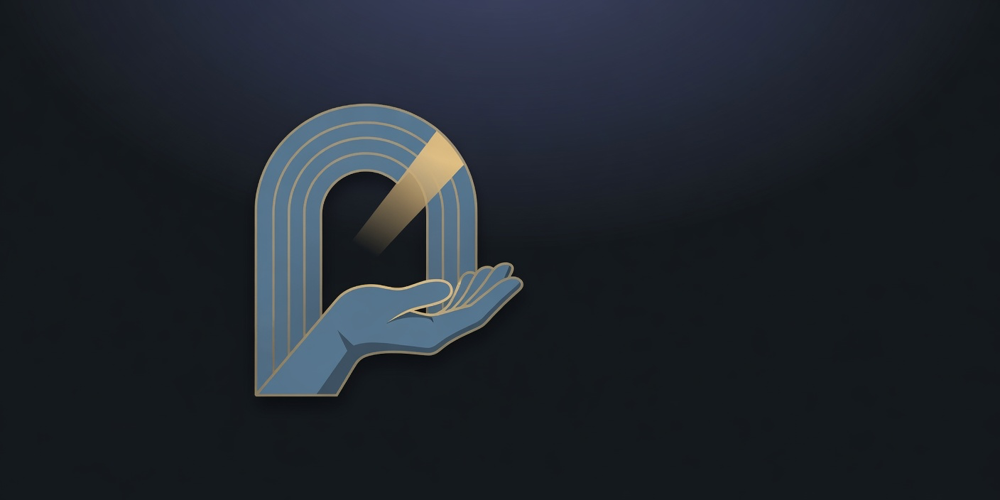

<!--
  Public organization profile only.
  Do not list private repositories, internal tooling, or stack details.
-->

 

# Erynoa

**Infrastructure and systems you can actually trust.**

Digital sovereignty by design · Est. 2025 · Germany

 

&nbsp;

&nbsp;

---

### What we care about

<table>
  <tr>
    <td width="33%" align="center">
      <strong>Trust</strong> 
      Systems whose behaviour you can reason about — not black boxes.
    </td>
    <td width="33%" align="center">
      <strong>Sovereignty</strong> 
      Control over data, infrastructure, and operational destiny.
    </td>
    <td width="33%" align="center">
      <strong>Craft</strong> 
      Serious engineering over hype — quiet quality that lasts.
    </td>
  </tr>
</table>

 

### How we show up

We build for operators and organizations that need **reliable digital foundations**.  
Most of our work stays private by design. What we publish here is the public face of the group — not a catalogue of active systems.

 

---

  © Erynoa ·
  <a href="https://erynoa.com">erynoa.com</a> ·
  <a href="mailto:contact@erynoa.com">contact@erynoa.com</a>

