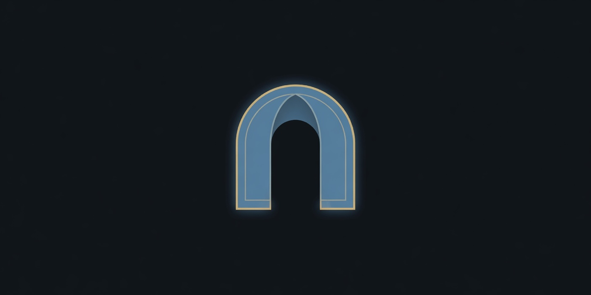

<!-- Public org profile. No private repos. -->

  

<h1 align="center">Erynoa</h1>

<strong>Software and systems for real operations.</strong>

Engineering company · Est. 2025 · Germany

  
  
  

---

<h3 align="center">Focus</h3>

<table>
  <tr>
    <td width="33%" align="center"><strong>Build</strong> Working software for production — not decks and demos.</td>
    <td width="33%" align="center"><strong>Operate</strong> Clear runbooks, boring reliability, things you can maintain.</td>
    <td width="33%" align="center"><strong>Own the stack</strong> Prefer systems you can inspect, change, and run yourself.</td>
  </tr>
</table>

We design and ship software used in day-to-day operations — platforms, tooling, and integrations. 
Most repositories here stay private. This page is the public contact surface of the group, not a product catalogue.

